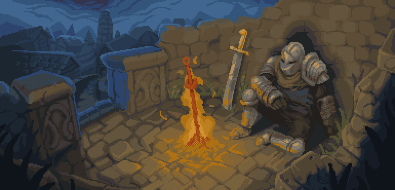

<!-- ════════════════════════════════════════════════════════════════ -->
<!--                        MAL0 · PROFILE README                       -->
<!--   Accent: #7800F0 (120,0,240) · highlights #A855F7 / #C77DFF       -->
<!--   Layout: flagship → agents & open source → shipped → activity     -->
<!-- ════════════════════════════════════════════════════════════════ -->

<!-- ───────────────────────────── BANNER ──────────────────────────── -->

  

<!-- ──────────────────────── NAME · TAGLINE ───────────────────────── -->

  

Computer Science · NJIT &nbsp;·&nbsp; Undergraduate Researcher, SocialX Lab &nbsp;·&nbsp; Wood-Ridge, NJ

  
  
  
  
  

<!-- ──────────────────────────── BIO ──────────────────────────────── -->

  I build agentic systems and the infrastructure beneath them — trading platforms, AI agents, world models, developer tools — and I learn a field by shipping something real inside it. Hand-rolled, tested, owned.

<!-- ─────────────────────────── FLAGSHIP ──────────────────────────── -->
<h3 align="center"><code>// flagship</code></h3>

  

<table align="center">
  <tr>
    <td align="right" width="160"><a href="https://github.com/mal0ware/Singularity"><b>Singularity</b></a></td>
    <td>Real-time black-hole renderer in C++20 — one header-only physics core, four GPU backends (Metal · Vulkan · WebGPU · CUDA), general relativity verified in CI. <a href="https://mal0ware.github.io/Singularity/"><b>Run it in your browser →</b></a></td>
  </tr>
  <tr>
    <td align="right"><a href="https://doi.org/10.5281/zenodo.19688805"><b>Beating the Market</b></a></td>
    <td>Published working paper: the probability of active-fund outperformance over 97 years of S&amp;P 500 data. Every claim reproduces from a seed-pinned function call, re-verified by CI on every push. <a href="https://github.com/mal0ware/sp500-active-management-analysis">Repo</a> · <a href="https://doi.org/10.5281/zenodo.19688805">DOI</a></td>
  </tr>
</table>

<!-- ────────────────────── AGENTS & OPEN SOURCE ───────────────────── -->
<h3 align="center"><code>// agents &amp; open source</code></h3>

<table align="center">
  <tr>
    <td align="right" width="160"><a href="https://github.com/mal0ware/Orpheus"><b>Orpheus</b></a></td>
    <td>MCP server bridging LLM agents to the REAPER digital audio workstation — hardened cross-language file-IPC, executable-spec test harness, first live DAW contact passed.</td>
  </tr>
  <tr>
    <td align="right"><a href="https://github.com/mal0ware/Kaizen"><b>Kaizen</b></a></td>
    <td>Always-on, self-improving personal AI agent — model routing, persistent memory, approval-gated self-modification.</td>
  </tr>
  <tr>
    <td align="right"><a href="https://github.com/mal0ware/Oneiros"><b>Oneiros</b></a></td>
    <td>A learned latent world model an agent plans with, exposed over MCP.</td>
  </tr>
</table>

<!-- ─────────────────────────── SHIPPED ───────────────────────────── -->
<h3 align="center"><code>// also shipped</code></h3>

  <a href="https://github.com/mal0ware/Cerebras-Protocol"><b>Cerebras-Protocol</b></a> — live IPO auction execution, filled at the Nasdaq cross, built in 7 days &nbsp;·&nbsp;
  <a href="https://github.com/mal0ware/Stock-Analyzer"><b>Stock-Analyzer</b></a> — from-scratch gradient boosting within ~1% of scikit-learn, 3-OS installers 
  <a href="https://github.com/mal0ware/Threatscope"><b>Threatscope</b></a> — self-hosted SIEM-lite threat intel &nbsp;·&nbsp;
  <a href="https://github.com/mal0ware/ytmerge"><b>ytmerge</b></a> — concurrent C++20 transcript CLI

<!-- ─────────────────────────── ACTIVITY ──────────────────────────── -->
<h3 align="center"><code>// activity</code></h3>

  
  

<picture>
  <source media="(prefers-color-scheme: dark)" srcset="https://raw.githubusercontent.com/mal0ware/mal0ware/output/github-snake.svg" />
  
</picture>

<code>for the love of the game.</code>

